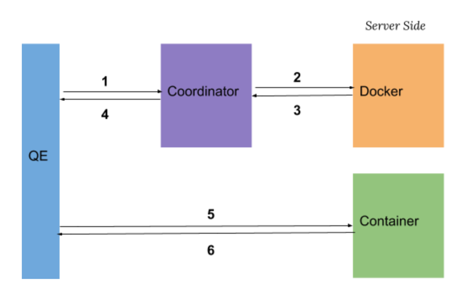

## Overview
Coordinator is a background worker in PostgreSQL/Greenplum. It decouples container management from backend process, so that plcontainer extension can focus on connecting to a compute service and retrieving result to the upper nodes within the plan tree.

## Memory and Variables
#### Shared Memory
* coordinator_address (protocol+address)
* container information collected by auxiliary process during docker inspection
#### Local Memory
* HTAB *requester_info_map
	
	```c
	typedef struct 
	{
	    int id; // pid of QE
	    int sock; // socket file descriptor between QE and coordinator
	} requester_info_entry;
	```
	
	Map request_id(pid of QE) to its detailed info. 
	
* HTAB *runtime_conf_table
	
	```c
	typedef struct runtimeConfEntry {
		char runtimeid[RUNTIME_ID_MAX_LENGTH];
		char *image;
		char *command;
		char *roles;
		Oid resgroupOid;
		int memoryMb;
		int cpuShare;
		int nSharedDirs;
		plcSharedDir *sharedDirs;
		bool useContainerNetwork;
		bool useContainerLogging;
		bool useUserControl;
	} runtimeConfEntry;
	```
	
	Map the relation from runtime_id to docker configuration.
	See `plcontainer_configuration.xml` in data directory.
## GUCs
* int max_container_number
	The maximum number of containers allocated by the coordinator allowed to exist concurrently.

* int check_loop_interval

  The time in seconds to indicate how long the auxiliary process checks whether a QE is still alive.
## Communication



1. QE sends `(QE_PID, runtime_id)` to the coordinator.
2. After receiving message from QE, coordinator creates a new request to Docker to allocate a container. 
3. For each received coordinator request, Docker allocates a container and sends container’s information back to the coordinator. 
4. Coordinator tells QE the `UDS address` corresponding to its request.

  5 & 6.  QE repeatedly sends the `Ping Message` to the allocated Container until it receives a `Ping Response` from the Container.

## Cache

In the above communication model, for every function call, QE will send a request to coordinator and wait until a newly created container becomes ready. This could cause a huge time delay before the function really being executed. To minimize the time delay, containers are cached for the same session, i.e. when a query is finished, its corresponding container will not be released immediately. The container will be running in idle mode, so that future query request with same runtime_id can directly reuse it.


## Coordinator Main Loop

Coordinator mainly handles the request from QE. It will maintain the `HTAB *requester_info_map` in its local memory (TBD). Once it receives a request from QE, it notify the docker to start a new container based on the runtime configuration. 

 When user manually press `CTRL+C` to interupt a query, the QE will send a message to coordinator. Coordinator will send a message to auxiliary process . As a result, after receiving such message, auxiliary process  will release all the containers of the specified QE. 

Note that loading runtime configuration and reloading it runs in coordinator process.


## Coordinator Initialization

* Initialize shared memory
  * init coordinator state to `uninitialized`
  * init unix domain socket
  * set unix domain socket address in shared memory
* Load container runtime configuration
* Set state of coordinator to `ready` in shared memory
* Enter main loop
  * Receive request from QE
  * Reload container runtime configuration if needed

## Coordinator Shutdown

Release all containers requested by the coordinator itself.


## Auxiliary Process

Auxiliary process helps the coordinator process to handle some time-consuming tasks, in particular container releasing, periodically container clean-up and docker inspection.